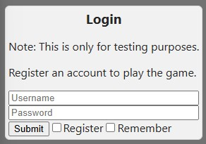
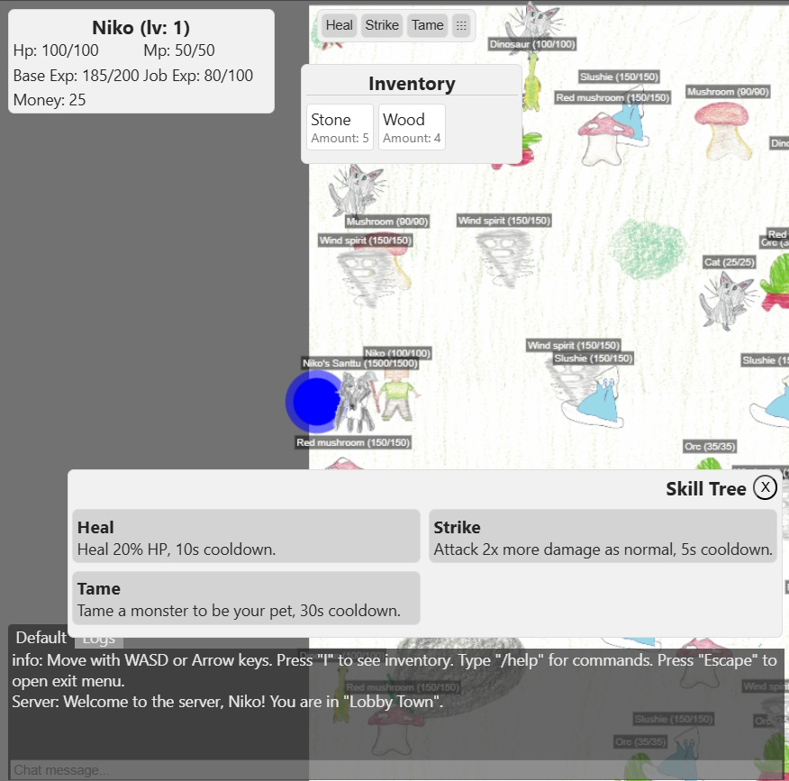
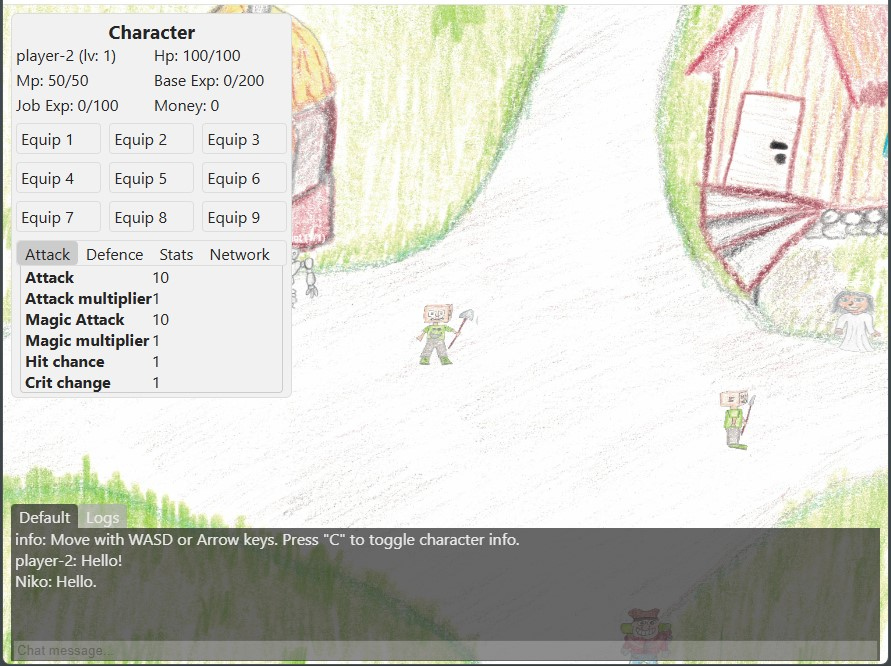
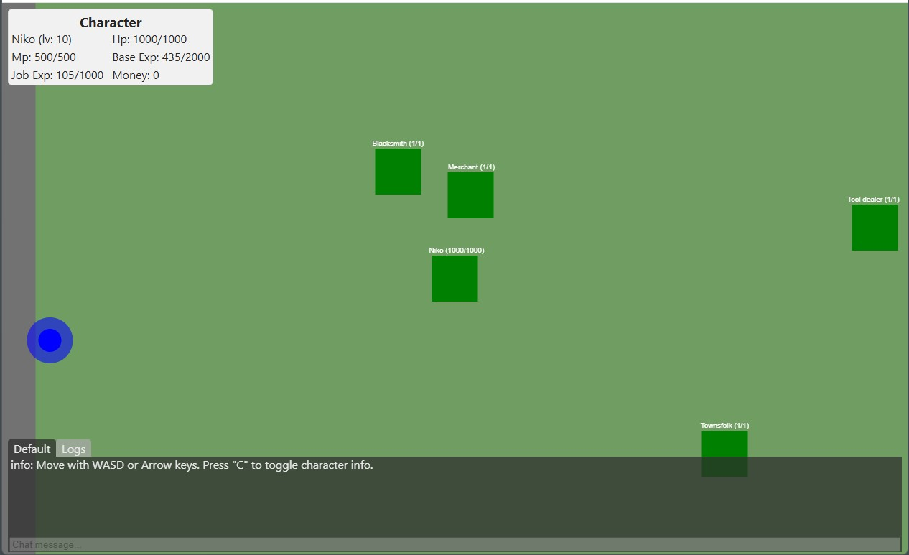

A NodeJS MMO Game Server
=======================

# Project Description

Welcome to our MMO-like game server. It's for learning purpose and fun!

> [!WARNING]
> This is an **experimental** project. Expect bugs and unfinished functionality.

## Overview

This project is a **test project** for learning purpose and having some fun in the process.
It's an MMO-like game that allows you ( or kids 😊 ) to draw textures for the entities
and maps used in the game, but of course, this requires the developer
to put them in the project assets manually and link them to the game.

## Gameplay

In this game, players can...

- Explore different maps and environments
- Interact with other players and NPCs (Non-Playable Characters)
- Customize characters, entities and maps with your own (or kids) drawing skills :)

**Please note: some of the demo assets are not included in the project!**

### Login view:



### Game view 1 (town):
Sample town where player can interact with NPC's


### Game view 1 (Strange NPC dialog):
Sample NPC interaction dialog UI


### Game view 3 (Plain field 1 - Monsters):
Sample field map with monsters


### Game view 4 (Other Players):
Sample with other player in same map


### Game view 5 (without any assets):
Sample without any image assets loaded


## Prerequisites
 - Some coding experience is required.
 - NodeJS & NPM installed
 - Optional: Certificates (see [./certs/README.md](./certs/README.md) for self-signed certs) set `SSL_KEY`, `SSL_CERT` and `PORT=443` in the `.env` file.
 - Have some skills with Paint or other drawing applications or an scanner machine for scanning paper drawings (like in the example images above).

## Getting Started

To get started with the game, follow these steps:

### Install

Start by installing the required Node modules in both client/ and server/ directories.

#### Client-side
```sh
cd client
npm install
```

Create or modify the `/client/.env` file and set web options:
```sh
# WebSocket URL
WS_URL=wss://127.0.0.1:3000/world
```

#### Server-side
```sh
cd server
npm install
```

Create or modify the `/server/.env` file and set web options:
```sh
# Web
HOST=127.0.0.1
#PORT=80
PORT=443
SSL_KEY=./certs/key.pem
SSL_CERT=./certs/cert.pem
JWT_SECRET=your_unique_secret
JWT_EXPIRES=2d
# Database salt
DB_SALT=your_unique_salt
# SQLite
SQLITE_FILE=./database.sqlite
```

### Database

**Note:** the project currently uses [SQLite](https://github.com/WiseLibs/better-sqlite3) for quick development,
but it can be changed to other databases like MariaDB.

 - Install [MariaDB](https://mariadb.com/downloads/), for the [nodejs connector](https://mariadb.com/kb/en/getting-started-with-the-node-js-connector/) to use it. See samples in [server/src/db/mariadb-sample/README.md](./server/src/db/mariadb-sample/README.md)

Modify the `/server/.env` file with database options (example)

### Build client app

```sh
npm run build
```

### Start the server

```sh
npm run start
```

### Open the Client app in browser

On Windows:
With SSL enabled:
```sh
explorer "https://127.0.0.1/"
```
and without it:
```sh
explorer "http://127.0.0.1/"
```

On MacOS:
With SSL enabled:
```sh
open "https://127.0.0.1/"
```
and without it:
```sh
open "http://127.0.0.1/"
```

## About the Client app
 - **The main focus here is in the server-side for now.**
 - Client here is just an example. I was thinking using the Phaser library for the game client, but it's not yet implemented.
 - See the *Future Plans* section below.

## Docs
 - Server-side start from [README](./server/README.md) or [server/index](./server/index.js) and follow from there.
 - Client-side start from [README](./client/README.md) or [client/index](./client/src/index.js) and follow from there.

## Future Plans
 - Improve safety.
 - Add more features:
   - Items and equipment
   - Skills/spells
   - Etc.
 - When the server-side is at the stable ground, start improving the client-side with Phaser or other game engine library.
 - Improve the README and documentation.

## License

This project is licensed under the [MIT License](LICENSE).
