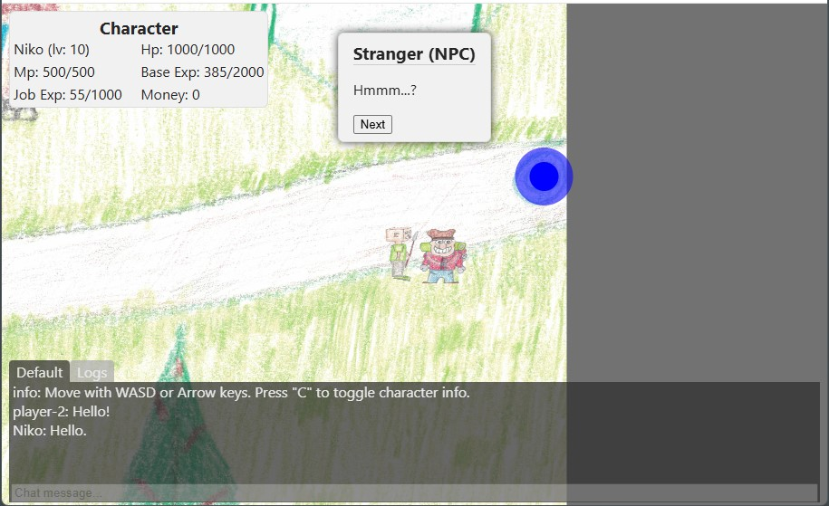

A NodeJS MMO Game Server
=======================

# Project Description

Welcome to our MMO-like game server. It's for learning purpose and fun!

## Overview

This project is a **test project** for learning and having some fun in the process. 
It's an MMO-like game that allows you ( or kids 😊 ) to draw textures for the entities 
and maps used in the game, but of course, this requires the developer 
to put them in the project assets manually.

## Gameplay

In this game, players can...

- Explore different maps and environments
- Interact with other players and NPCs (Non-Playable Characters)
- Customize characters, entities and maps with your own (or kids) drawing skills :)

**Please note: some of the demo assets are not included in the project!**

Login view:


Game view 1 (town):


Game view 1 (Strange NPC dialog):



Game view 3 (Plain field 1 - Monsters):


Game view 4 (Other Players):


Game view 5 (without any assets):


## Prerequisites
 - Some coding experience is required.
 - NodeJS & NPM installed
 - MariaDB or other database installed
 - Optional: Certificates (see [./certs/README.md](./certs/README.md) for self-signed certs) set `SSL_ENABLED=true` and `PORT=443` in the `.env` file.
 - Have some skills with Paint or other drawing applications or an scanner machine for scanning paper drawings (like in the example images above).

## Getting Started

To get started with the game, follow these steps:

### Install

Start by installing the required Node modules.

```sh
npm install
```

Create or modify the `.env` file and set web options:
```sh
# Web
HOST=127.0.0.1
#PORT=80
PORT=443
SSL_ENABLED=true
SSL_KEY=./certs/key.pem
SSL_CERT=./certs/cert.pem
JWT_SECRET=your_unique_secret
JWT_EXPIRES=2d
```

### Database

You need to have or install [MariaDB](https://mariadb.com/downloads/), for the [nodejs connector](https://mariadb.com/kb/en/getting-started-with-the-node-js-connector/) to use it.

Create the database: see the [src/db/main.sql](./src/db/main.sql) SQL file for the database structure.

Set database user privileges to read and write. Examples:
```sql
-- Create database --
CREATE DATABASE myDatabase;

-- Create user --
CREATE USER 'myUser'@localhost IDENTIFIED BY 'myPassword';
CREATE USER 'myUser'@127.0.0.1 IDENTIFIED BY 'myPassword';

-- Grant all privileges --
GRANT ALL PRIVILEGES ON *.* TO 'myUser'@localhost IDENTIFIED BY 'myPassword';
GRANT ALL PRIVILEGES ON *.* TO 'myUser'@127.0.0.1 IDENTIFIED BY 'myPassword';

-- Grant specific privileges --
GRANT create, select, insert, delete, alter, update, drop ON myDatabase.* TO 'myUser'@'localhost' IDENTIFIED BY 'myPassword';
GRANT create, select, insert, delete, alter, update, drop ON myDatabase.* TO 'myUser'@'127.0.0.1' IDENTIFIED BY 'myPassword';

-- Update active privileges and show what were granted --
FLUSH PRIVILEGES;
SHOW GRANTS FOR 'myUser'@localhost;
```

Create or modify the `.env` file with database connection options (example):
```sh
# MariaDB
DB_HOST=127.0.0.1
DB_USER=myUser
DB_PASS=myPassword
DB_DATABASE=myDatabase
DB_PORT=3306
DB_CONNECTION_LIMIT=5
DB_SALT=your_unique_salt
```

### Start the server

```sh
npm run start
```

### Build sample Client app

```sh
npm run build
```

### Open the Client app in browser

On Windows:
With SSL enabled:
```sh
explorer "https://127.0.0.1/"
```
and without it:
```sh
explorer "http://127.0.0.1/"
```

On MacOS:
With SSL enabled:
```sh
open "https://127.0.0.1/"
```
and without it:
```sh
open "http://127.0.0.1/"
```

## About the Client app
 - **The main focus here is in the server-side for now.**
 - Client here is an example. I was thinking using the Phaser library for the game client, but it's not yet implemented.
 - SPA made with [Mithril.js](https://mithril.js.org/) library.
 - See the *Future Plans* section below.

## Docs
 - See more documentation in the [docs/README.md](./docs/README.md).
 - Or view the source files, it's pretty verbal with comments. Start from [server.js](./server.js) and follow from there.

## Future Plans
 - Improve safety.
 - Add more features:
   - Items and equipment
   - Skills/spells
   - Etc.
 - When the server-side is at the stable ground, start improving the client-side with Phaser or other game engine library.
 - Improve the README and documentation.

## Contributing

Contributions are welcome to make the game even better. Here are some ways you can contribute:

- Report bugs or issues
- Suggest new features or improvements
- Submit pull requests with code changes

## License

This project is licensed under the [MIT License](LICENSE).
