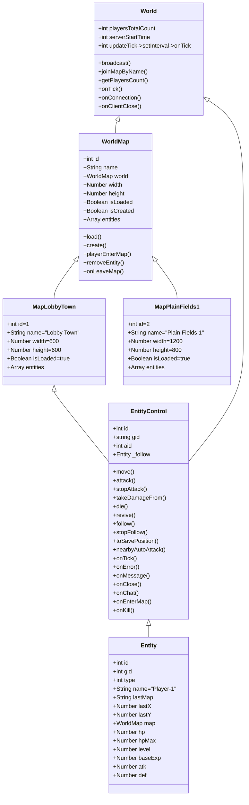

# Docs

TODO some guides how things work around here...

Sample diagram:

```mermaid
classDiagram
    World <|-- WorldMap
    World: +int playersTotalCount
    World: +int serverStartTime
    World: +int updateTick->setInterval->onTick
    World: +broadcast()
    World: +joinMapByName()
    World: +getPlayersCount()
    World: +onTick()
    World: +onConnection()
    World: +onClientClose()
    class WorldMap{
      +int id
      +String name
      +WorldMap world
      +Number width
      +Number height
      +Boolean isLoaded
      +Boolean isCreated
      +Array entities
      +load()
      +create()
      +playerEnterMap()
      +removeEntity()
      +onLeaveMap()
    }
    WorldMap <|-- MapLobbyTown
    MapLobbyTown <|-- EntityControl
    class MapLobbyTown{
      +int id=1
      +String name="Lobby Town"
      +Number width=600
      +Number height=600
      +Boolean isLoaded=true
      +Array entities
    }
    WorldMap <|-- MapPlainFields1
    class MapPlainFields1{
      +int id=2
      +String name="Plain Fields 1"
      +Number width=1200
      +Number height=800
      +Boolean isLoaded=true
      +Array entities
    }
    EntityControl <|-- Entity
    World <|-- EntityControl
    class EntityControl {
        +int id
        +string gid
        +int aid
        +Entity _follow
        +move()
        +attack()
        +stopAttack()
        +takeDamageFrom()
        +die()
        +revive()
        +follow()
        +stopFollow()
        +toSavePosition()
        +nearbyAutoAttack()
        +onTick()
        +onError()
        +onMessage()
        +onClose()
        +onChat()
        +onEnterMap()
        +onKill()
    }
    class Entity {
        +int id
        +int gid
        +int type
        +String name="Player-1"
        +String lastMap
        +Number lastX
        +Number lastY
        +WorldMap map
        +Number hp
        +Number hpMax
        +Number level
        +Number baseExp
        +Number atk
        +Number def
    }
```
