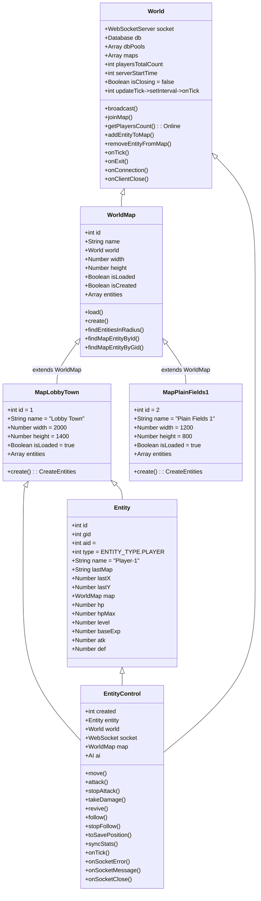

# Docs

TODO
 - add some guides how things work around here...
 - explain how to create maps, entity textures and how to use them.
 - explain how the login / register flow works
 - Server side docs
 - Client side docs

Sample diagram:

