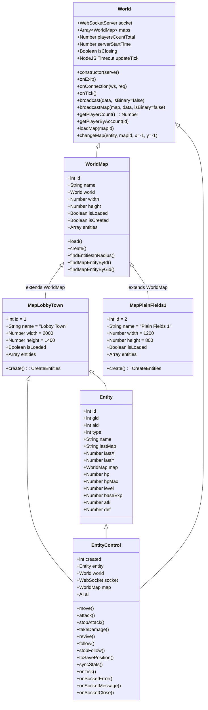

# NodeJS Game — Server

# Overview
- Server side of the NodeJS game. Provides WebSocket/game logic, REST API endpoints, and persistence.
- Uses Express for HTTP APIs and `ws` for WebSocket communication. Database access via `node:sqlite`.

# Quick start
- Install dependencies, run the server, or run tests:

```bash
npm install
npm run start    # runs `node index.js` (production/startup)
npm run test     # runs Jest tests
```

# Project structure (server)
- index.js — server process entry (bootstraps HTTP/WS servers and loads configuration)
- babel.config.cjs — Babel config for transpilation (if used)
- certs/ — local certificates and notes for TLS during development
- src/
  - server.js — main HTTP/WebSocket handlers
  - World.js — world state and map management
  - actions/ — functions to create/remove entities and other game actions
  - api/ — REST API routes, middleware, login/register handlers
  - control/ — server-side entity controllers (AI, player control, pets)
  - db/ — database access layer and schema helpers
  - events/ — game event routing and packet handling
  - maps/, response/, utils/ — supporting modules
- shared/, data/, enum/, models/, utils/, websocket/ — code shared with client and domain data (items, mobs, models, packet definitions)

# Notes
- Configuration via environment variables (loadable with `dotenv`).
- Development certificates are stored under `certs/` for local TLS testing; change or regenerate as needed.
- Tests use Jest; run `npm run test` from the `server/tests/` folder.
- Entry points: `index.js` (top-level) and `src/server.js` (server internals).


# World class

`World` manages the server's runtime state: the WebSocket server, available maps, player lifecycle and periodic updates.


